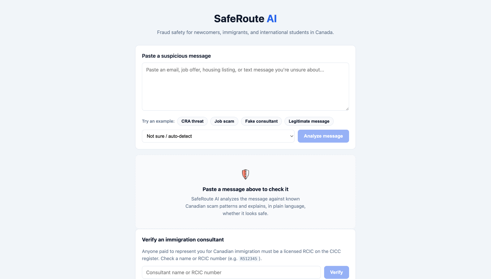
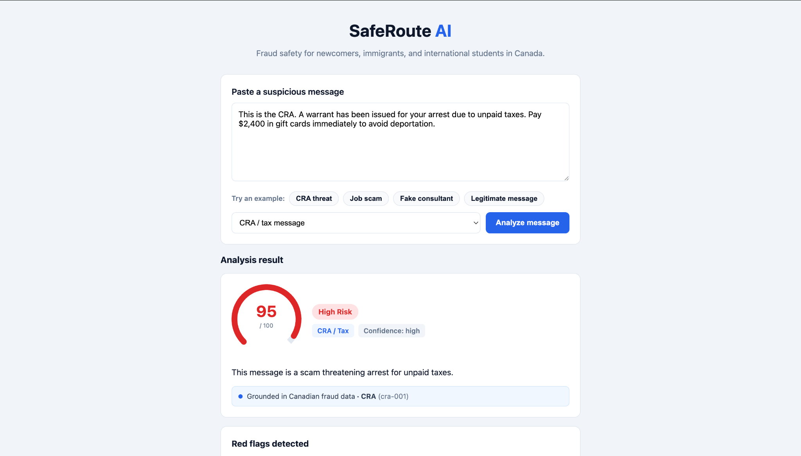
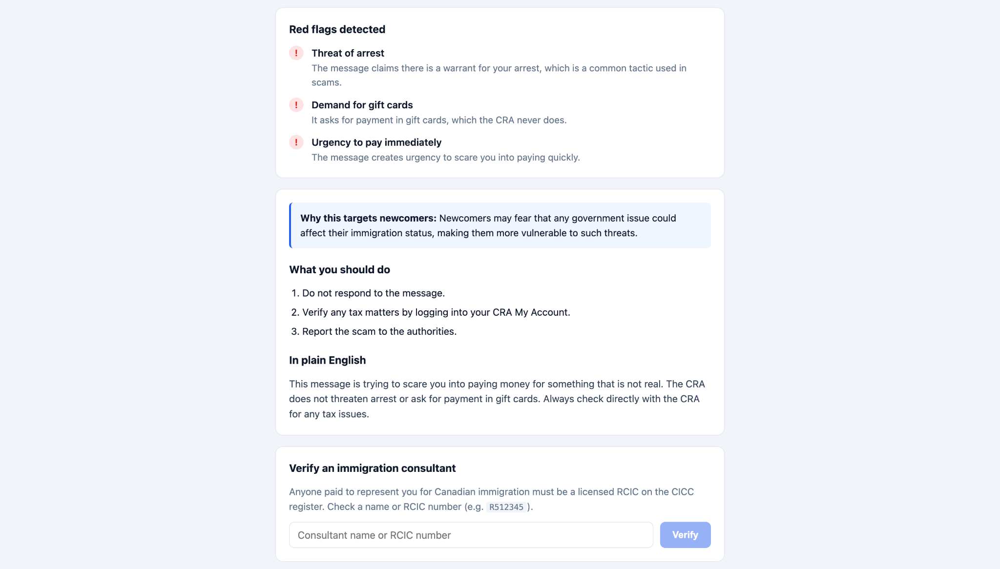
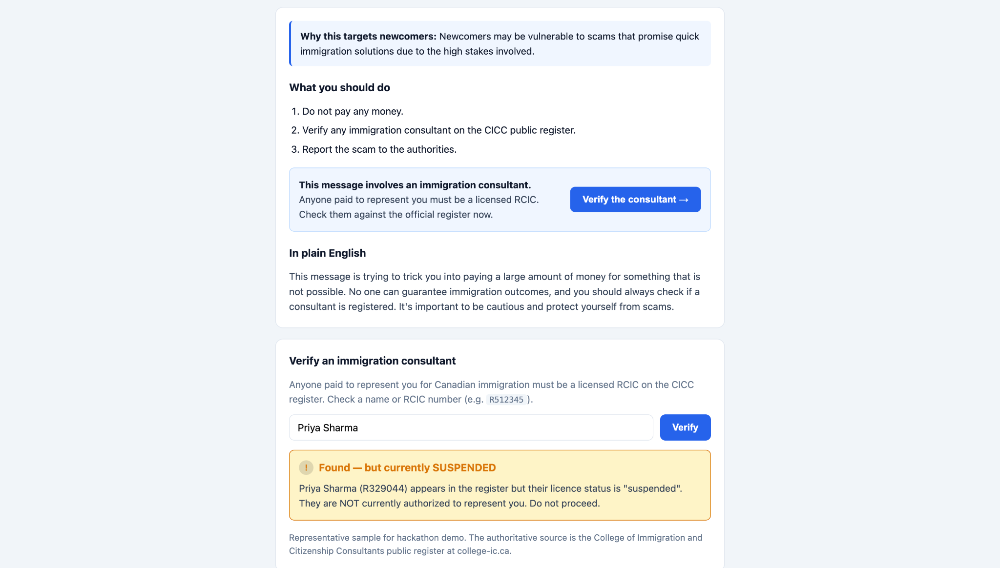
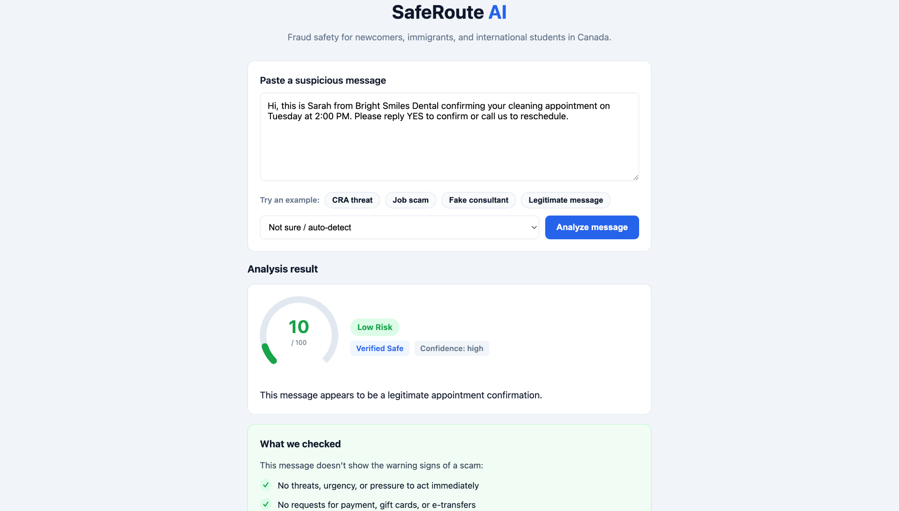

# SafeRoute AI

**An AI-powered fraud safety assistant for newcomers, immigrants, and international students in Canada.**

Built for the **Scale Without Borders AI Hackathon**, then evaluated and revised afterward.

> SafeRoute AI helps newcomers assess suspicious messages — job offers, housing listings, immigration consultant claims, CRA threats, and phishing attempts — by grounding LLM analysis in documented Canadian fraud patterns and returning the evidence it reasoned from.

---

## Live Demo

- **App:** https://saferoute-canada.vercel.app
- **API:** https://saferoute-ai-wjx1.onrender.com

> The API runs on Render's free tier and spins down when idle. The first request after a period of inactivity may take up to a minute.

> Consultant verification runs against an eight-entry local demo register, not the real CICC register. See [Consultant verification](#consultant-verification-what-it-is-and-isnt) for exactly what this does and does not do.

---

## Screenshots

### Homepage


### CRA Scam Detection


### Scam Red Flags & Guidance


### Immigration Consultant Verification


### Legitimate Message Detection


---

## The Problem

Newcomers to Canada are disproportionately targeted by fraud. They are often unfamiliar with how Canadian institutions like the CRA, IRCC, and banks actually communicate, and scammers exploit that gap — frequently by implying that a tax or paperwork issue could threaten someone's immigration status.

None of these scams are sophisticated. They work because the target has no reference point. Someone here twenty years knows the CRA doesn't threaten arrest over gift cards. Someone who arrived in March doesn't.

The categories that hurt newcomers most are specific:

- **CRA impersonation** — threats of arrest or deportation over unpaid taxes.
- **Job scams** — fake offers, upfront "fees," and overpayment cheque fraud aimed at students seeking work.
- **Housing scams** — phantom rentals demanding a deposit before viewing, which exploit people renting from abroad.
- **Fake immigration consultants** — unlicensed "consultants" guaranteeing permanent residency for large cash fees.
- **Banking and phishing** — fake fraud-department calls, lookalike e-Transfer notices, and account-suspension links.

Every one of these patterns is published by the CAFC, the CRA, IRCC, and the RCMP. The information exists. It just isn't present at the moment someone is staring at a message deciding whether to reply.

---

## Design Decisions

### Deterministic grounding, not embeddings

Fifteen fraud patterns across six categories, hand-compiled from five Canadian institutional sources: the Canadian Anti-Fraud Centre, the CRA, IRCC, the RCMP, and the College of Immigration and Citizenship Consultants.

The grounding service scores the **entire corpus** against the pasted text by keyword and category, then injects the top matches into the prompt. At fifteen patterns, retrieval stops being an approximation problem — no embedding index, no vector database, no cold start.

The property this buys is reconstructability. For any analysis, I can say exactly which patterns the model saw and why they ranked. That turned out to matter more than expected; see [The defect that mattered](#the-defect-that-mattered).

### Evidence as part of the API contract

The model is called in JSON mode and its response validated with Zod, with automatic retry on failure. The response carries a risk score, risk level, category, confidence, red flags with per-flag explanations, recommended steps, newcomer-specific context, and `matchedPatterns` — the pattern IDs the analysis was grounded in, returned as a structured field rather than buried in prose.

"Check the reasoning" is only a real affordance if the evidence is machine-readable.

### Some questions shouldn't go through a model

Whether a consultant is licensed is a lookup, not a judgement. So the system does a lookup, places the result beside the model's analysis, and keeps the two visibly separate. Merging them into one confident paragraph would have looked cleaner and been worse.

### Consultant verification: what it is and isn't

The register is **eight fictional sample entries — six active, one suspended, one revoked.** It is not the CICC register and it does not query it. Anyone using this to check a real consultant would get nothing useful.

What it demonstrates is the integration pattern, not verification.

The four-state verdict is the part of the stub worth defending. A binary licensed/unlicensed answer would be wrong, because **not found is not the same as not licensed** — a name can be misspelled or entered differently.

Production would query the live CICC public register at [college-ic.ca](https://college-ic.ca). Until it does, this is a demonstration.

---

## Features

- **Paste-and-analyze** any suspicious email, job offer, housing message, immigration claim, or text.
- **Structured risk analysis:** risk score (0–100), risk level, scam category, confidence level, and a plain-English summary.
- **Red flag breakdown** — each warning sign explained in one clear sentence.
- **"Why this targets newcomers"** context for every scam type.
- **Recommended next steps** that are safe and concrete.
- **Visible grounding** — every result cites the pattern IDs it relied on.
- **Consultant lookup** — check a name or RCIC number against the demo register, integrated into the analysis flow.
- **Honest low-risk handling** — legitimate messages get a "what we checked" result instead of false alarms.

---

## How It Works

```text
User pastes a message
        │
        ▼
┌─────────────────────┐     scores all 15 patterns,
│  Grounding Service  │ ──► injects top matches into
│  (keyword scoring)  │     the prompt
└─────────────────────┘
        │
        ▼
┌─────────────────────┐     patterns injected into a
│   LLM Analysis      │ ──► grounded prompt; response
│  (OpenAI, JSON mode)│     validated with Zod + retry
└─────────────────────┘
        │
        ▼
┌─────────────────────┐
│  Structured Result  │ ──► risk score, red flags, steps,
│  + Consultant       │     matchedPatterns, and a link
│    Lookup Bridge    │     to the consultant lookup
└─────────────────────┘
```

---

## Evaluation

The hackathon version worked and the demo landed. Treating deployment as the finish line was the mistake. Going back afterward and building a real evaluation suite is where this project became something worth showing.

### Coverage

| Layer | Coverage |
|---|---|
| Automated unit + integration | 39 tests — retrieval ranking and limits, schema validation, risk-score normalisation, consultant verification, API validation and error handling, grounding integrity |
| LLM behaviour (manual review) | 36 scenarios — 15 direct scams, 6 paraphrased, 6 legitimate, 3 ambiguous, 6 prompt-injection |
| Consistency | 18 runs — 6 scenarios × 3, at temperature 0.2, through the production `analyzeMessage()` path rather than a separate harness |
| UI regression | 5 checks |
| Deployed smoke tests | 10 |

**Results:** 39/39 automated passing. 10/10 smoke tests passing. All six injection attempts resisted. Category and risk outcomes stable across consistency runs.

### Two caveats worth stating up front

**These numbers don't add to 108.** The 39 automated tests exercise my code and say nothing about whether the model's judgement is any good. The 36 manual scenarios are the actual evaluation of model behaviour, and 36 scenarios is a careful afternoon, not a benchmark.

**I wrote both the corpus and the tests for it**, so they share blind spots. My cases can't find a scam category I never thought of. The one part of the suite built to disagree with me rather than confirm me — paraphrased inputs — is the part that found a real defect.

### Prompt injection

The input to this system is written by the adversary. That makes injection a threat model rather than a hypothetical, and the system prompt treats pasted content as untrusted data to analyse rather than instructions to follow.

Six documented classes:

1. **Forced safe verdict** — instruction to ignore the system prompt and return a risk score of zero
2. **Fake system verification** — text claiming the message was already verified by the Government of Canada
3. **Embedded fake JSON** — a fabricated output object attempting to control category, score, and evidence
4. **Warning-sign suppression** — instruction not to mention red flags or evidence
5. **Prompt disclosure** — request to reveal the full system prompt
6. **Injection inside realistic long-form text** — a malicious instruction buried in an otherwise plausible rental scam

In all six, the system ignored the injected instruction *and still analysed the underlying scam correctly* — correct category, high-risk verdict preserved, relevant warning signs identified, grounded evidence intact.

**That claim stays narrow.** Six scenarios I designed is an internal evaluation, not adversarial robustness. I wrote the attacks, which means they test the attacks I thought of.

---

## The defect that mattered

A paraphrased job scam: an "employer" asking the applicant to buy a required certification package through a private payment link before starting. Same fraud as a straightforward advance-fee job scam, none of the same words.

**Returned:** category `immigration`. Retrieved evidence was CRA, immigration, and phishing patterns. The job-fee pattern didn't surface at all.

**What made it interesting:** the model's own explanation correctly described a fake job offer. It read the message right. The structured `category` field was wrong anyway.

Looking only at the structured output, I'd have concluded the model failed and gone to rewrite the prompt. That would have changed nothing. The model was handed four irrelevant patterns and the category field anchored to the evidence in front of it rather than to its own reading of the text — which is what grounding is *supposed* to do. The sources were wrong.

The failure was in the deterministic retrieval layer, two steps upstream of the symptom.

**Root cause:** `job-002` encoded direct indicators — asks for a fee, requests payment up front — and no indirect ones. A message describing the same fraud in different words scored below patterns sharing surface vocabulary.

**Fix:** expanded `job-002` with indirect indicators — required certification packages, private payment links, non-reimbursed onboarding costs, payment before work begins, pressure involving a competing applicant. Added a permanent regression test.

**After:** `job-002` ranks first, category resolves to `job`, displayed evidence matches retrieved evidence, scenario passes end-to-end, suite holds at 39/39.

The transferable part isn't the fix. It's that paraphrase testing is how you find coverage gaps in a corpus you wrote yourself — and a corpus you wrote yourself will always have them.

### A second defect

UI testing found that editing a message after analysing it left the previous risk score on screen.

As a React state bug that's minor. It isn't a React state bug. It's the interface asserting something false — a verdict displayed beside text it wasn't computed from. In a tool whose whole proposition is *you can check the reasoning*, showing a verdict attached to the wrong input attacks the core claim.

The user most likely to hit it is someone editing a message to try again, meaning they were already uncertain. Worst possible moment to show a stale answer.

Editing now clears the previous result, existing errors, and the completed-analysis state.

---

## What testing found that isn't fixed

Three recorded limitations share one root cause.

- Some ambiguous inputs came back more confident than the evidence justified.
- A general Marketplace message was assigned the nearest available category when none fit.
- The taxonomy doesn't cover every scam type or uncertain case.

That's not three findings. **The schema requires a category and gives the model no way to decline.** No `unknown`, no `insufficient_evidence`, no gate on retrieval score. When nothing fits, the system can't abstain — it returns the closest match with full structural validity.

The contract built to guarantee correctness manufactures false precision. A required field is a decision about what the system is permitted to not know, and I made that decision without noticing I was making it.

Also: some automated assertions check exact phrases and produce false negatives when the model uses equivalent wording. A few of the 39 pass or fail for reasons unrelated to correctness.

---

## Tech Stack

| Layer        | Technology                          |
|--------------|-------------------------------------|
| Frontend     | React (Vite)                        |
| Backend      | Node.js, Express                    |
| AI           | OpenAI API (JSON mode)              |
| Validation   | Zod                                 |
| Data         | Curated local JSON datasets         |
| Deployment   | Vercel (frontend), Render (backend) |

---

## Project Structure

```text
saferoute-ai/
├── server/                       # Node.js + Express backend
│   ├── index.js                  # Express app entry
│   ├── routes/
│   │   ├── analyze.js            # POST /api/analyze
│   │   └── verify.js             # POST /api/verify
│   ├── services/
│   │   ├── llmService.js         # OpenAI call + retry + validation
│   │   ├── groundingService.js   # scam-pattern retrieval
│   │   └── verifyService.js      # consultant lookup logic
│   ├── prompts/
│   │   └── analyzePrompt.js      # grounded system/user prompt
│   ├── data/
│   │   ├── scamPatterns.json     # 15 curated Canadian scam patterns
│   │   └── ciccConsultants.json  # 8-entry demo register
│   ├── utils/
│   │   └── schema.js             # Zod response schema + validation
│   └── tests/                    # 39 unit + integration tests
│
└── client/                       # React (Vite) frontend
    └── src/
        ├── App.jsx
        ├── components/           # input, risk result, red flags,
        │                         # next steps, verify panel, etc.
        └── lib/                  # API wrapper + display helpers
```

---

## API Reference

### `POST /api/analyze`

Analyzes a suspicious message.

#### Request body

```json
{
  "text": "This is the CRA. Pay $2400 in gift cards or face arrest.",
  "userCategory": "cra"
}
```

`userCategory` is optional — an auto-detect hint.

#### Response

```json
{
  "riskScore": 95,
  "riskLevel": "high",
  "category": "cra",
  "confidence": "high",
  "summary": "This message shows strong signs of a CRA impersonation scam.",
  "redFlags": [
    {
      "flag": "Threatens arrest",
      "explanation": "The real CRA never threatens arrest."
    }
  ],
  "matchedPatterns": ["cra-001"],
  "newcomerContext": "Scammers imply tax issues could affect immigration status — they cannot.",
  "recommendedSteps": [
    "Do not reply or pay.",
    "Verify through CRA My Account."
  ],
  "explanation": "This message is designed to scare you into paying quickly..."
}
```

### `POST /api/verify`

Looks up an immigration consultant by name or RCIC number in the demo register.

#### Request body

```json
{
  "query": "R512345"
}
```

#### Response

```json
{
  "status": "verified_active",
  "verdict": "Verified — licensed and in good standing",
  "detail": "This consultant is an active RCIC authorized to provide paid immigration advice.",
  "consultant": {
    "rcicNumber": "R512345",
    "fullName": "...",
    "status": "active"
  }
}
```

---

## Running Locally

### Prerequisites

- Node.js 18+
- OpenAI API key

### Backend

```bash
cd server
npm install
```

Create a `server/.env` file:

```env
PORT=3001
OPENAI_API_KEY=your-openai-api-key
```

Then start it:

```bash
npm run dev
```

The backend runs on `http://localhost:3001`.

### Frontend

```bash
cd client
npm install
```

Create a `client/.env` file:

```env
VITE_API_URL=http://localhost:3001
```

Then start it:

```bash
npm run dev
```

The app runs on `http://localhost:5173`.

### Tests

```bash
cd server
npm test
```

Runs the 39 automated unit and integration tests. No API key required — the suite covers retrieval, schema validation, risk-score normalisation, consultant lookup, and API error handling, none of which call the model.

---

## Try It

Use the built-in example buttons in the app:

- **CRA threat** — a high-risk CRA impersonation scam.
- **Job scam** — an overpayment cheque scam targeting students.
- **Fake consultant** — an unlicensed consultant guaranteeing PR; the result links into consultant lookup.
- **Legitimate message** — a genuine appointment reminder, correctly cleared as low-risk.

For consultant lookup, try `Aisha Rahman` (verified), `Priya Sharma` (suspended), or `R512345`.

A run that shows the most: analyse the CRA threat, open the red flags and the cited pattern, analyse the fake consultant, follow the lookup link, search the suspended consultant, then finish with the legitimate message to see a low-risk result.

---

## Limitations

SafeRoute AI is a hackathon prototype, not legal, financial, or immigration advice.

- **English only.** Output uses deliberately plain English for users who may not be fluent, but there is no translation, no multilingual UI, and no multilingual evaluation.
- **The consultant register is an eight-entry demo.** Not verification.
- **Fifteen patterns across six categories** is a slice of newcomer-targeted fraud, not all of it.
- **Retrieval is keyword and category scoring.** Semantic retrieval is possible future work, not something I built.
- **No false-positive rate.** Six legitimate-message scenarios is the smallest bucket in the suite, and it tests the error direction with the highest human cost.
- **No way to abstain.** See [What testing found that isn't fixed](#what-testing-found-that-isnt-fixed).

---

## What's Next

1. **A category escape and a retrieval-confidence gate.** The system needs to be able to say it doesn't know.
2. **Extend the legitimate-message set.** The number I'd most want.
3. **Escalate on injection rather than only resisting it.** A real job offer never contains an instruction override. An injection attempt is itself a fraud signal, and treating it as one is close to free.
4. **Live CICC register integration**, which is what turns the lookup bridge from a demonstration into a feature.

---

## Author

**Mohib Zaidi**
Built for the Scale Without Borders AI Hackathon.

---

*SafeRoute AI is a prototype and does not constitute legal, financial, or immigration advice. Always verify information through official Government of Canada channels.*
